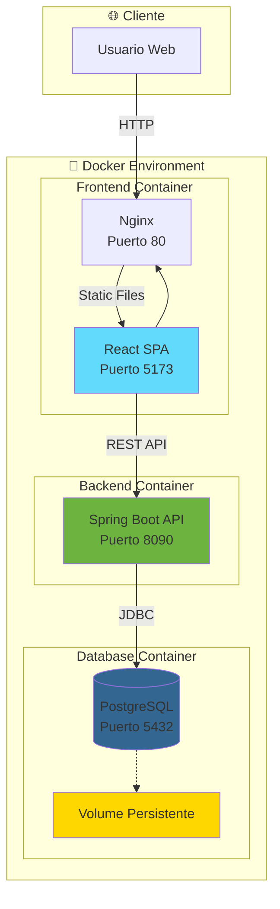

# 📝 Task Manager - Sistema de Gestión de Tareas

## 📖 Descripción

Task Manager es una aplicación web completa para la gestión de tareas desarrollada con arquitectura de microservicios contenerizados. El sistema permite crear, visualizar, actualizar y eliminar tareas con una interfaz moderna y una API REST robusta. Implementa las mejores prácticas de desarrollo con Spring Boot en el backend, React en el frontend, y PostgreSQL como base de datos, todo orquestado con Docker y Docker Compose.

## 🏗️ Arquitectura

El sistema implementa una **arquitectura de microservicios contenerizados** distribuida en tres capas principales:



### Patrón Arquitectónico
- **Frontend**: Single Page Application (SPA) con React
- **Backend**: Arquitectura en Capas (Layered Architecture)
- **Base de Datos**: Patrón Repository con JPA/Hibernate
- **Comunicación**: API REST con formato JSON

## 🛠️ Tecnologías

### Backend
- **Framework**: Spring Boot 3.2.2 + Java 17
- **Base de Datos**: PostgreSQL 14 + Spring Data JPA
- **Documentación**: Swagger/OpenAPI 2.2.0
- **Mapeo**: MapStruct 1.5.5 + Lombok 1.18.36
- **Validación**: Spring Boot Validation

### Frontend
- **Framework**: React 19.1.1 + Vite 7.1.7
- **Servidor Web**: Nginx Alpine
- **Estilos**: Tailwind CSS 3.4.18 + CSS personalizado
- **HTTP Client**: Axios 1.12.2
- **Routing**: React Router DOM 7.9.4
- **Notificaciones**: SweetAlert2 11.26.2

### Orquestación
- **Contenedores**: Docker + Docker Compose v3.9
- **Red**: Bridge network personalizada
- **Persistencia**: Docker Volumes
- **Monitoreo**: Healthchecks para PostgreSQL

## 📋 Requisitos Previos

- **Docker**: 20.10+ 
- **Docker Compose**: 2.0+
- **Git**: Para clonación del repositorio
- **Navegador Web**: Moderno (Chrome, Firefox, Safari, Edge)

## 🚀 Instalación y Ejecución

### 1. Clonar repositorio
```bash
git clone https://github.com/MrxSteve/LabImplantacion-Docker.git
cd LabImplantacion-Docker
```

### 2. Configurar variables de entorno
```bash
# Copiar y editar el archivo de entorno
cp .env-copy .env

# Editar las variables en .env
DB_HOST=localhost
DB_PORT=5435
DB_NAME=lab-implantacion-postgres-db
DB_USERNAME=tu_usuario
DB_PASSWORD=tu_password
```

### 3. Levantar servicios
```bash
# Construir y ejecutar todos los servicios
docker-compose up --build

# Ejecutar en segundo plano
docker-compose up --build -d

# Ver logs en tiempo real
docker-compose logs -f
```

### 4. Acceder a la aplicación

| Servicio | URL | Descripción |
|----------|-----|-------------|
| **Frontend** | http://localhost:5173 | Aplicación web principal |
| **API Backend** | http://localhost:8090/api | API REST endpoints |
| **Swagger UI** | http://localhost:8090/swagger-ui.html | Documentación interactiva |
| **PostgreSQL** | localhost:5435 | Base de datos (solo interno) |

## 🔧 Comandos Útiles

### Docker Compose
```bash
# Ver estado de servicios
docker-compose ps

# Parar todos los servicios
docker-compose down

# Parar y eliminar volúmenes
docker-compose down -v

# Reconstruir solo un servicio
docker-compose build lab-implantacion-api

# Ver logs de un servicio específico
docker-compose logs lab-implantacion-api

# Ejecutar comando en contenedor
docker-compose exec lab-implantacion-db psql -U postgres

# Verificar healthcheck
docker inspect lab-implantacion-postgres --format='{{.State.Health.Status}}'
```

### Desarrollo
```bash
# Reiniciar solo backend
docker-compose restart lab-implantacion-api

# Ver logs del frontend
docker-compose logs -f lab-implantacion-web

# Acceder al contenedor de la base de datos
docker-compose exec lab-implantacion-db bash
```

## 📁 Estructura del Proyecto

```
lab-implantacion-docker/
├── 📄 docker-compose.yaml          # Orquestación de servicios
├── 📄 README.md                    # Documentación principal
├── 📄 .env-copy                    # Plantilla de variables de entorno
├── 📂 backend/                     # API Spring Boot
│   ├── 📄 Dockerfile               # Imagen Docker del backend
│   ├── 📄 pom.xml                  # Dependencias Maven
│   ├── 📄 .dockerignore            # Exclusiones Docker
│   └── 📂 src/main/java/com/implantacion/backend/
│       ├── 📂 config/              # Configuraciones (Swagger, CORS)
│       ├── 📂 controllers/         # REST Controllers
│       ├── 📂 services/            # Lógica de negocio
│       ├── 📂 repositories/        # Acceso a datos (JPA)
│       ├── 📂 models/              # Entidades y DTOs
│       └── 📂 utils/               # Utilidades (Mappers, Errors)
├── 📂 frontend/                    # SPA React
│   ├── 📄 Dockerfile               # Imagen Docker del frontend  
│   ├── 📄 nginx.conf               # Configuración Nginx
│   ├── 📄 package.json             # Dependencias NPM
│   ├── 📄 .dockerignore            # Exclusiones Docker
│   └── 📂 src/
│       ├── 📂 components/          # Componentes React
│       ├── 📂 pages/               # Páginas principales
│       ├── 📂 services/            # Cliente API (Axios)
│       └── 📄 styles.css           # Estilos personalizados
└── 📂 docs/
    └── 📄 arquitectura.md          # Documentación técnica detallada
```

## 🌐 API Endpoints

### Tareas (Tasks)

| Método | Endpoint | Descripción | Body |
|--------|----------|-------------|------|
| `POST` | `/api/tasks` | Crear nueva tarea | `{"title": "string"}` |
| `GET` | `/api/tasks` | Listar todas las tareas (paginado) | Query: `page`, `size` |
| `GET` | `/api/tasks/{id}` | Obtener tarea por ID | - |
| `PUT` | `/api/tasks/{id}` | Actualizar estado de tarea | `{"completed": boolean}` |
| `DELETE` | `/api/tasks/{id}` | Eliminar tarea | - |

### Ejemplos de uso

#### Crear tarea
```bash
curl -X POST http://localhost:8090/api/tasks \
  -H "Content-Type: application/json" \
  -d '{"title": "Complete project documentation"}'
```

#### Listar tareas (página 0, tamaño 10)
```bash
curl "http://localhost:8090/api/tasks?page=0&size=10"
```

#### Actualizar tarea
```bash
curl -X PUT http://localhost:8090/api/tasks/1 \
  -H "Content-Type: application/json" \
  -d '{"completed": true}'
```

#### Eliminar tarea
```bash
curl -X DELETE http://localhost:8090/api/tasks/1
```

### Respuestas de la API

#### Tarea (TaskResponse)
```json
{
  "id": 1,
  "title": "Complete project documentation",
  "completed": false,
  "createdAt": "2025-10-15T10:30:00"
}
```

#### Lista paginada
```json
{
  "content": [
    {
      "id": 1,
      "title": "Complete project documentation",
      "completed": false,
      "createdAt": "2025-10-15T10:30:00"
    }
  ],
  "pageable": {
    "sort": {"sorted": false, "unsorted": true},
    "pageNumber": 0,
    "pageSize": 10
  },
  "totalPages": 1,
  "totalElements": 1,
  "size": 10,
  "number": 0
}
```

## 👥 Autores

- **Estudiante 1**: [Geofrey Steve Muñoz Tobar]
- **Estudiante 2**: [Ismael Enrique Garcia Hernandez]

## 📅 Fecha

**Fecha de entrega**: Octubre 2025

---

## 📚 Recursos Adicionales

- [Documentación de Arquitectura Detallada](./docs/arquitectura.md)
- [Swagger UI - Documentación Interactiva](http://localhost:8090/swagger-ui.html)
- [Código fuente en GitHub](https://github.com/MrxSteve/LabImplantacion-Docker)

## 🔒 Consideraciones de Seguridad

- Variables de entorno para credenciales sensibles
- Red Docker privada para comunicación interna
- Puerto de base de datos no expuesto externamente
- Configuración CORS restrictiva en desarrollo

## 📊 Métricas del Sistema

- **Imágenes**: ~400MB total (Backend: ~200MB, Frontend: ~50MB, DB: ~150MB)
- **Recursos mínimos**: 4GB RAM, 2 vCPUs, 10GB almacenamiento
- **Tiempo de inicio**: ~60 segundos (con healthchecks)

---

*Sistema desarrollado como parte del Laboratorio de Implantación de Sistemas con Docker*
