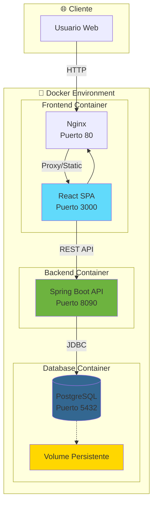
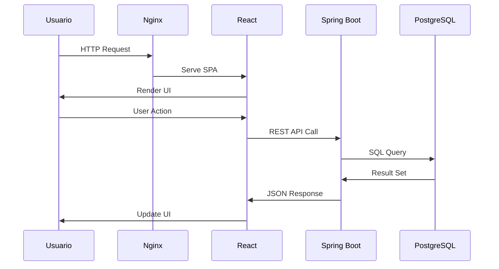

# 🏗️ Arquitectura del Sistema - Lab Implantación Docker

## 📋 Tabla de Contenidos
- [Vista General](#-vista-general)
- [Arquitectura de Contenedores](#-arquitectura-de-contenedores)
- [Tecnologías Utilizadas](#-tecnologías-utilizadas)
- [Análisis por Componentes](#-análisis-por-componentes)
- [Comunicación entre Servicios](#-comunicación-entre-servicios)
- [Docker Compose](#-docker-compose)
- [Dockerfiles](#-dockerfiles)
- [Persistencia de Datos](#-persistencia-de-datos)

---

## 🎯 Vista General

Este sistema implementa una **arquitectura de microservicios contenerizados** con Docker, que consta de tres componentes principales:

- **Frontend**: SPA en React con Vite servido por Nginx
- **Backend**: API REST en Spring Boot con Java 17
- **Base de Datos**: PostgreSQL 14 con persistencia



---

## 🏛️ Arquitectura de Contenedores

### Patrón Arquitectónico
- **Frontend**: Arquitectura SPA (Single Page Application)
- **Backend**: Arquitectura en Capas (Layered Architecture)
- **Comunicación**: Cliente-Servidor con API REST
- **Persistencia**: Patrón Repository con JPA/Hibernate

### Distribución de Puertos
| Servicio | Puerto Host | Puerto Contenedor | Acceso |
|----------|-------------|-------------------|--------|
| Frontend (Nginx) | 3000 | 80 | Público |
| Backend (Spring Boot) | 8090 | 8090 | Interno/API |
| PostgreSQL | 5432 | 5432 | Interno |

---

## 🛠️ Tecnologías Utilizadas

### Frontend Stack
```json
{
  "framework": "React 19.1.1",
  "buildTool": "Vite 7.1.7",
  "webServer": "Nginx Alpine",
  "styling": "Tailwind CSS 3.4.18",
  "httpClient": "Axios 1.12.2",
  "routing": "React Router DOM 7.9.4",
  "notifications": "SweetAlert2 11.26.2"
}
```

### Backend Stack
```json
{
  "framework": "Spring Boot 3.2.2",
  "language": "Java 17",
  "persistence": "Spring Data JPA",
  "database": "PostgreSQL Driver",
  "documentation": "Swagger/OpenAPI 2.2.0",
  "mapping": "MapStruct 1.5.5",
  "utilities": "Lombok 1.18.36",
  "validation": "Spring Boot Validation"
}
```

### Infrastructure
```json
{
  "containerization": "Docker & Docker Compose v3.9",
  "database": "PostgreSQL 14",
  "webServer": "Nginx Alpine",
  "persistence": "Docker Volumes"
}
```

---

## 🔍 Análisis por Componentes

### 1. 🎨 Frontend (React + Nginx)

#### Estructura del Componente
- **Framework**: React 19 con hooks modernos
- **Build Tool**: Vite para desarrollo y construcción optimizada
- **Web Server**: Nginx como servidor web y proxy reverso

#### Características Principales
- SPA con routing del lado del cliente
- Comunicación asíncrona con el backend via Axios
- UI moderna con Tailwind CSS
- Notificaciones interactivas con SweetAlert2

### 2. ⚙️ Backend (Spring Boot)

#### Arquitectura en Capas
```
📁 com.implantacion.backend
├── 🎯 controllers/     # Capa de Presentación (REST Controllers)
├── 🏢 services/        # Capa de Lógica de Negocio
├── 🗄️ repositories/    # Capa de Acceso a Datos
├── 📊 models/          # Modelos de Datos (Entities & DTOs)
├── ⚙️ config/          # Configuraciones (Swagger)
└── 🛠️ utils/           # Utilidades (Mappers, Errors, Seeders)
```

#### Patrones Implementados
- **REST API**: Endpoints RESTful para operaciones CRUD
- **DTO Pattern**: Separación entre entidades y objetos de transferencia
- **Repository Pattern**: Abstracción del acceso a datos
- **Mapper Pattern**: Conversión automática entre DTOs y entidades
- **Exception Handling**: Manejo globalizado de errores

### 3. 🗄️ Base de Datos (PostgreSQL)

#### Configuración
- **Versión**: PostgreSQL 14
- **Persistencia**: Volume Docker para datos permanentes
- **Configuración**: Variables de entorno para conexión
- **ORM**: Hibernate con generación automática de esquema

---

## 🔄 Comunicación entre Servicios

### Flujo de Datos


### Red Docker
- **Red Personalizada**: `implantacion-net` (bridge driver)
- **Resolución DNS**: Los contenedores se comunican usando nombres de servicio
- **Aislamiento**: Red privada para comunicación interna

### Variables de Entorno
```bash
# Base de Datos
DB_HOST=lab-implantacion-db    # Nombre del servicio Docker
DB_PORT=5432
DB_NAME=${DB_NAME}
DB_USERNAME=${DB_USERNAME}
DB_PASSWORD=${DB_PASSWORD}

# Frontend
VITE_API_URL=http://localhost:8090/api
```

---

## 🐳 Docker Compose

### Archivo: `docker-compose.yaml`

```yaml
version: '3.9'

services:
  # 🗄️ Base de Datos
  lab-implantacion-db:
    image: postgres:14
    container_name: lab-implantacion-postgres
    restart: unless-stopped
    env_file: .env
    environment:
      POSTGRES_DB: ${DB_NAME}
      POSTGRES_USER: ${DB_USERNAME}
      POSTGRES_PASSWORD: ${DB_PASSWORD}
    ports:
      - "${DB_PORT}:5432"
    volumes:
      - lab_implantacion_postgres_data:/var/lib/postgresql/data
    networks:
      - implantacion-net

  # ⚙️ Backend API
  lab-implantacion-api:
    build:
      context: ./backend/
      dockerfile: Dockerfile
    container_name: lab-implantacion-api
    depends_on:
      - lab-implantacion-db
    environment:
      DB_HOST: lab-implantacion-db
      DB_PORT: 5432
      DB_NAME: ${DB_NAME}
      DB_USERNAME: ${DB_USERNAME}
      DB_PASSWORD: ${DB_PASSWORD}
    ports:
      - "8090:8090"
    networks:
      - implantacion-net

# 📂 Volúmenes Persistentes
volumes:
  lab_implantacion_postgres_data:

# 🌐 Redes
networks:
  implantacion-net:
    driver: bridge
```

### Características del Compose

#### Orquestación
- **Dependencias**: API espera a que DB esté disponible
- **Reinicio**: `unless-stopped` para alta disponibilidad
- **Variables**: Configuración externa con archivo `.env`

#### Networking
- **Red Bridge**: Comunicación interna entre contenedores
- **DNS Interno**: Resolución automática de nombres de servicio
- **Aislamiento**: Red privada separada del host

---

## 📦 Dockerfiles

### 1. Backend Dockerfile

```dockerfile
# 🏗️ Imagen base con JDK 17
FROM eclipse-temurin:17-jdk-alpine

# 📦 Instalar Maven directamente
RUN apk add --no-cache maven

# 📁 Directorio de trabajo
WORKDIR /app

# 📋 Copiar POM y descargar dependencias (cache layer)
COPY pom.xml ./
RUN mvn dependency:go-offline -B

# 📁 Copiar código fuente y compilar
COPY . .
RUN mvn clean package -DskipTests -B

# 🚀 Ejecutar aplicación
CMD ["java", "-jar", "target/backend-0.0.1-SNAPSHOT.jar"]
```

#### Optimizaciones Implementadas
- **Multi-stage Build**: Separación de dependencias y código
- **Layer Caching**: Dependencias Maven se cachean independientemente
- **Imagen Alpine**: Base ligera para menor tamaño
- **Batch Mode**: Compilación sin interacción (`-B`)

### 2. Frontend Dockerfile

```dockerfile
# 🏗️ STAGE 1: Build
FROM node:20-alpine AS build
WORKDIR /app

# 📦 Instalar dependencias (cache layer)
COPY package*.json ./
RUN npm ci

# 🏗️ Build de producción
COPY . .
ARG VITE_API_URL=http://localhost:8090/api
ENV VITE_API_URL=$VITE_API_URL
RUN npm run build

# 🚀 STAGE 2: Runtime
FROM nginx:alpine

# 📁 Copiar archivos estáticos
COPY --from=build /app/dist /usr/share/nginx/html

# ⚙️ Configuración Nginx personalizada
COPY nginx.conf /etc/nginx/conf.d/default.conf

EXPOSE 80
CMD ["nginx", "-g", "daemon off;"]
```

#### Características del Build
- **Multi-stage Build**: Separación de build y runtime
- **Optimización**: Solo archivos de producción en imagen final
- **Variables de Build**: URL de API configurable
- **Nginx Customizado**: Configuración específica para SPA

### 3. Configuración Nginx

```nginx
server {
    listen 80;
    server_name _;
    
    root /usr/share/nginx/html;
    index index.html;
    
    # 🎯 SPA Routing - Fallback a index.html
    location / {
        try_files $uri $uri/ /index.html;
    }
    
    # 🚀 Cache de Assets Estáticos
    location ~* \.(?:js|css|woff2?|ttf|eot|ico|png|jpe?g|gif|svg)$ {
        expires 7d;
        add_header Cache-Control "public, max-age=604800, immutable";
        try_files $uri =404;
    }
}
```

---

## 💾 Persistencia de Datos

### Volume Docker
```yaml
volumes:
  lab_implantacion_postgres_data:
    # Volume manejado por Docker
    # Ubicación: /var/lib/docker/volumes/
```

### Características
- **Persistencia**: Datos sobreviven a reinicios de contenedores
- **Backup**: Volume puede ser respaldado independientemente
- **Performance**: Mejor rendimiento que bind mounts
- **Portabilidad**: Fácil migración entre entornos

### Configuración de Base de Datos
```properties
# application.properties
spring.datasource.url=jdbc:postgresql://${DB_HOST}:${DB_PORT}/${DB_NAME}
spring.jpa.hibernate.ddl-auto=update
spring.jpa.show-sql=true
```

---

## 🚀 Comandos de Despliegue

### Construcción y Ejecución
```bash
# Construir y ejecutar todos los servicios
docker-compose up --build

# Ejecutar en segundo plano
docker-compose up --build -d

# Ver logs
docker-compose logs -f

# Parar servicios
docker-compose down

# Parar y eliminar volúmenes
docker-compose down -v
```

---

## 📊 Métricas del Sistema

### Tamaños Estimados de Imágenes
- **Frontend**: ~50MB (Nginx + archivos estáticos)
- **Backend**: ~200MB (JDK + aplicación Spring Boot)
- **PostgreSQL**: ~150MB (imagen oficial)

### Recursos Recomendados
- **CPU**: 2 vCPUs mínimo
- **RAM**: 4GB mínimo (2GB para backend, 1GB para DB, 1GB sistema)
- **Almacenamiento**: 10GB mínimo

---

## 🔒 Consideraciones de Seguridad

### Variables de Entorno
- Uso de archivo `.env` para credenciales
- Variables de entorno en contenedores
- No hardcodear secretos en imágenes

### Red
- Red privada para comunicación interna
- Solo puertos necesarios expuestos al host
- Nginx como proxy y servidor de archivos estáticos

### Base de Datos
- Credenciales configurables
- Volume persistente para datos
- Puerto no expuesto directamente (solo interno)

